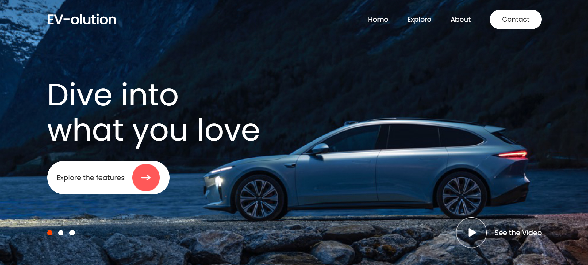

# 🚗 EV-olution Landing Page


A modern and responsive **EV Landing Page** built using **React.js** and **Vite**. This project features a fullscreen background slideshow, video background support, responsive navigation with a mobile hamburger menu, an interactive hero section, and smooth animations. It was built to practice **React Hooks, state management, component-based architecture, conditional rendering, responsive web design, and CSS animations**.

---

## 📸 Project Preview

<p align="center">
  
</p>

---

## 🌐 Live Demo

🔗 **View Live Demo:**  
https://website-header-design-five.vercel.app/

---

## ✨ Features

- 🚗 Modern EV Landing Page UI
- 🖼️ Automatic Background Image Slideshow
- 🎥 Play/Pause Background Video
- 🎯 Interactive Hero Section
- 🍔 Responsive Hamburger Navigation
- 📱 Fully Responsive Design
- ⚡ Smooth Fade-In Background Animation
- 🎨 Clean & Modern User Interface
- 🧩 Reusable React Components
- 🔄 Automatic Hero Content Switching
- 🖱️ Interactive Navigation Menu
- 💻 Optimized for Desktop, Tablet & Mobile

---

## 🛠️ Tech Stack

- ⚛️ React.js
- ⚡ Vite
- 🎨 CSS3
- 💻 JavaScript (ES6+)
- 🌐 HTML5

---

## 📂 Project Structure

```text
Website_Header_Design/
├── public/
├── src/
│   ├── assets/
│   │   ├── arrow_btn.png
│   │   ├── image1.png
│   │   ├── image2.png
│   │   ├── image3.png
│   │   ├── pause_icon.png
│   │   ├── play_icon.png
│   │   ├── preview.png
│   │   └── video1.mp4
│   │
│   ├── Components/
│   │   ├── Background/
│   │   │   ├── Background.jsx
│   │   │   └── Background.css
│   │   │
│   │   ├── Hero/
│   │   │   ├── Hero.jsx
│   │   │   └── Hero.css
│   │   │
│   │   └── Navbar/
│   │       ├── Navbar.jsx
│   │       └── Navbar.css
│   │
│   ├── App.css
│   ├── App.jsx
│   ├── index.css
│   └── main.jsx
│
├── .gitignore
├── eslint.config.js
├── index.html
├── package-lock.json
├── package.json
├── vite.config.js
└── README.md
```

---

## 🚀 Getting Started

### Clone the repository

```bash
git clone https://github.com/RohitSutar1823/Website_Header_Design.git
```

### Navigate to the project

```bash
cd Website_Header_Design
```

### Install dependencies

```bash
npm install
```

### Install React Icons

```bash
npm install react-icons
```

### Start the development server

```bash
npm run dev
```

The application will run at:

```text
http://localhost:5173
```

---

## 🎯 What I Practiced

- ⚛️ React Functional Components
- 🎣 React Hooks (`useState`, `useEffect`)
- 🧩 Component-Based Architecture
- 🔄 State Management
- 🎯 Event Handling
- 🖼️ Dynamic Background Switching
- 🎥 Video Background Integration
- 🧠 Conditional Rendering
- 🍔 Responsive Hamburger Navigation
- 📱 Responsive Web Design
- 📐 CSS Flexbox
- 🎨 CSS Animations & Transitions
- 🌈 Media Queries
- 💡 Clean Folder Structure
- 🚀 Building Modern Landing Pages

---

## 📱 Responsive Design

✔️ Desktop 🖥️

✔️ Laptop 💻

✔️ Tablet 📱

✔️ Mobile 📲

✔️ Responsive Navigation Menu 🍔

---

## 🔥 React Concepts Used

- ✅ JSX
- ✅ Props
- ✅ useState()
- ✅ useEffect()
- ✅ Conditional Rendering
- ✅ Dynamic Class Names
- ✅ Event Handling
- ✅ Component Reusability
- ✅ State Updates
- ✅ Automatic UI Rendering

---

## 🎨 CSS Concepts Used

- 🎯 Flexbox
- 📏 Media Queries
- 🌈 CSS Animations
- ⚡ CSS Transitions
- 🎭 CSS Positioning
- 🖼️ Object Fit
- 📱 Responsive Layout
- 🎯 Hover Effects
- 🧩 Z-Index Layering
- 🎨 Modern UI Styling

---

## 👨‍💻 Author

**Rohit Sutar**

- 🐙 GitHub: https://github.com/RohitSutar1823

---


# ⭐ Mini React Project

This **EV-olution Landing Page** was built as a practice project to strengthen my **React.js** and **Responsive Web Design** skills. During development, I gained hands-on experience with **React Hooks (`useState`, `useEffect`), reusable components, state management, conditional rendering, responsive navigation, CSS Flexbox, media queries, background image/video switching, animations, and modern landing page UI design**.

Building this project helped me understand how professional landing pages are structured, how responsive layouts adapt to different screen sizes, and how React components work together to create clean, interactive, and reusable user interfaces.
